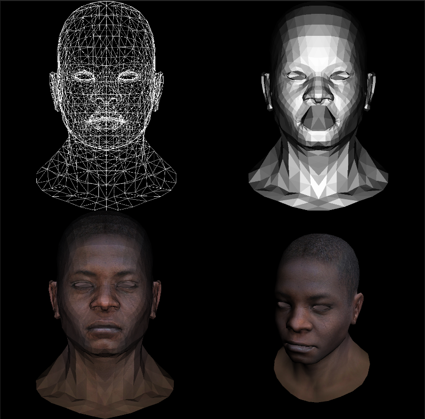

# renderer

This project is the C implementation of the course [ssloy/tinyrenderer](https://github.com/ssloy/tinyrenderer). The code is much clearer and easier to understand. I wish this project can help those who cannot understand the original course learn well.

Each tag is corresponding to the lessons in the course. As C-lang is not cross-platform, I only implement the one in Windows platform. Please feel free to push requests, thanks.

